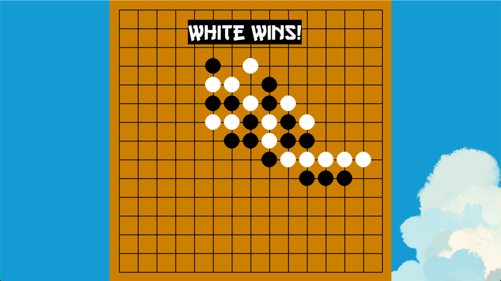

# Gomoku_Group_9

**Gomoku_Group_9** is a Gomoku game AI based on Monte Carlo Tree Search. It's written in Python. 

**Gomoku_Group_9** is not only used for Gomoku game, but you can also customize the size of the board and an n-in-a-row game. Tic-tac-toe, for example, is a 3-in-a-row game, and played on a board of size 3.

This repo provides a visual game interface, easy-to-use training process, and easy-to-understand code. 

Enjoy yourself ~~~

## Available now 

## Next step

Monte Carlo tree -> Visual game interface -> Custom battle.

## References & thanks

About the algorithm, **Omega_Gomoku_AI** refers to this article: [Monte Carlo Tree Search – beginners guide](https://int8.io/monte-carlo-tree-search-beginners-guide/), written by [int8](https://github.com/int8).

## Code structure

- [testsettingy.py](Gomoku_Group_9/testsettingy.py) - Start the game, human vs AI, or human vs human.
- [Function.py](Gomoku_Group_9/Function.py) - Some functions.
- [Game/](Gomoku_Group_9/Game/)
  - [Start.py](Gomoku_Group_9/Game/Start.py) - Start the game screen.
  - [Draw.py](Gomoku_Group_9/Game/Draw.py) - Draw the game.
  - [Board.py](Gomoku_Group_9/Game/Board.py) - Create board.
- [AI/](Gomoku_Group_9/AI/)
  - [AI_MCTS.py](Gomoku_Group_9/AI/AI_MCTS.py) - AI player with pure MCTS.
  - [MonteCarloTreeNode.py](Omega_Gomoku_AI/AI/MonteCarloTreeNode.py) - Base class for nodes in Monte Carlo Tree.

## Enjoy...

## License

**Gomoku_Group_9** is licensed under MIT license. See [LICENSE](LICENSE) for details.

